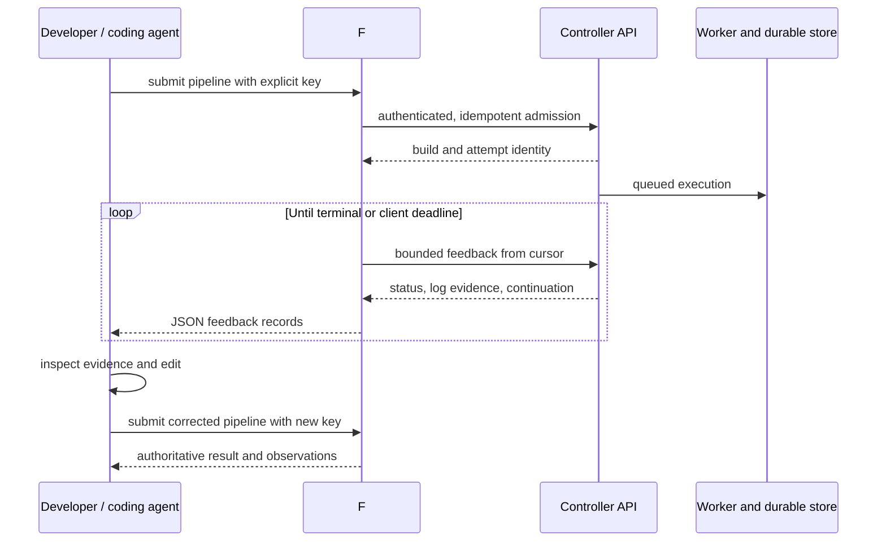
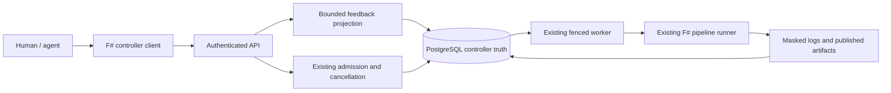
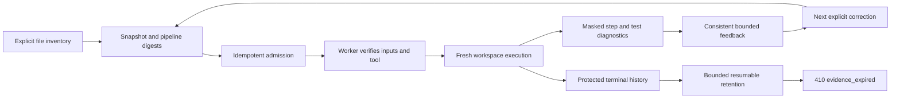

# Design boards: CI for the AI development loop

Status: Implementation design for the owner-requested 2026-09-22 initiative.
Requirements below are not claims of implemented capability. Delivery status
and evidence live in the [ticket board](../AI_FEEDBACK_BOARD.md).

## Product board

**User:** a developer and their coding agent working on mutually trusted projects
on a dedicated Linux controller. **Job:** test a proposed change and obtain
enough precise evidence to decide the next edit without manually scraping a UI.

**Success unit:** one observed failure → corrected submission → authoritative
successful result. A fast queue or fast interpreter alone does not prove this.

| Moment | User need | Product requirement |
| --- | --- | --- |
| Submit | Know what ran and avoid duplicate work after a timeout | Explicit project and idempotency key; durable build/attempt IDs; later, verified immutable revision identity |
| Observe | Learn early without consuming unlimited context | Progressive cursor reads, bounded feedback pages, explicit continuation and terminal semantics |
| Diagnose | Distinguish a test failure from unavailable infrastructure | Preserve controller status, reconciliation, cancellation, and named API refusals; later, typed step/test diagnostics |
| Correct | Run a new candidate intentionally | A new submission/key for changed input; reuse a key only for the identical request; no automatic replay of uncertain effects |
| Verify | Trust that success belongs to the candidate | Authoritative durable result; drain admitted output; later, bind result to verified revision and environment |

M1 exposes execution status and bounded log evidence. It must not infer a failed
test, source location, remediation, or revision from arbitrary shell output.
Build output is untrusted data for a consuming agent, never an instruction or
permission to execute suggested commands.

## Interaction board

A client deadline stops waiting; it does not silently cancel a running build.
Cancellation is explicit and its acknowledgement is not a terminal result.
Transport errors, unknown statuses, malformed responses, and reconciliation
must never map to success. No retry operation is added in M1: resubmission is
an intentional new build using existing admission semantics.

## Architecture board

Keep one execution engine and PostgreSQL authority. The client holds no worker
lease or maintenance database capability. A feedback read causes no execution,
repair, retry, filesystem traversal, or effect reconciliation. Reuse tenant and
project lineage checks. Do not expose raw event payloads or pipeline definitions
through the feedback projection: they have not been audited as safe output.

### M1 feedback interface

`GET /api/v1/organizations/{organizationId}/projects/{projectId}/builds/{buildId}/feedback?from=N`
returns a versioned JSON read model with `schema_version: 1`, `build_id`,
`status`, `cancellation_requested`, `is_terminal`, `from_sequence`,
`next_sequence`, `has_more`, `truncated`, and `chunks` (`sequence`, `body`,
`truncated`). The top-level truncation flag is true if any represented chunk
was truncated; it is independent of whether another chunk remains.

The server caps count at its existing MaxLogChunks setting and response log
content at 64 KiB UTF-8. An oversized individual chunk is represented by a
valid UTF-8 prefix and explicit `truncated` metadata; its original sequence is
consumed, and the existing logs endpoint remains available for complete admitted
content. The cursor advances only over represented chunks. `has_more` describes
remaining log chunks in that snapshot, not whether the build can publish later.
Status and log page must share one database snapshot, so a terminal page does
not race a separate earlier log read. Retried reads may repeat evidence; clients
deduplicate by sequence. This is a polling interface, not SSE.

Completion for the client requires an authoritative terminal status and no
remaining chunks in the snapshot. `reconciliation_required` stops a normal
watch with a distinct non-success outcome but is not asserted to be successful
or safely retryable. Terminal status vocabulary must come from the existing
domain and store. Unknown values refuse rather than becoming success.

### Client interface

Provide `submit`, `status`, `logs`, `feedback`, `watch`, and `cancel` commands.
Use explicit URL, organization/project/build identifiers and a token file;
credentials never appear in command arguments or diagnostic output. JSON is the
machine interface. HTTP requests and watch duration have finite deadlines;
redirects cannot forward credentials. HTTPS is required except literal loopback
HTTP for local development. No automatic mutating request retries.

Only a successful terminal build returns success from `watch`. Document exit
codes for a completed unsuccessful build, invalid invocation, API/transport
failure, client timeout, and reconciliation. Keep response reads bounded even
if a controller or proxy ignores the contract. Cancellation remains an explicit
command. Reconnecting clients can resume with a sequence cursor.

## Measurement board

### M2 and M3 implementation

The [source snapshot contract](../runbooks/source-snapshots.md) adds explicit
content inputs, pipeline and manifest digests, a correction-loop ID, and optional
enforced runner-tool identity. The worker checks these inputs and installs them
in a fresh workspace. This verifies captured content; it does not assert that a
dirty tree is a clean Git commit. The original bounded envelope can be downloaded
for intentional reproduction while its evidence remains retained.

[Execution diagnostics](EXECUTION_DIAGNOSTICS.md) carry typed failed steps,
JUnit cases, and infrastructure reasons. Masking precedes truncation under the
shared credential lock. Diagnostics share fenced publication and the bounded log
cursor; their stable identity includes the attempt and local sequence. Feedback
samples status, evidence, retention state and source attribution in one database
snapshot, including across retry transitions.

[Retention](RETENTION.md) is an operator maintenance command with bounded
age/count/size sweeps and durable deletion intent. It includes build-owned HOME,
stash, workspace, source transport, journal and artifact payloads. Active,
uncertain and retry lineage evidence remains protected. Selected evidence returns
410 throughout deletion and holds; status metadata survives.

The [self-hosted pilot profile](../runbooks/self-hosted-pilot.md) declares the
source workload, cache condition, sample count, capacity policy and recovery
objectives. It exercises real Domain builds/tests plus HOME and stash writes.
Paired restore verifies database and state inventories, invalidates pre-restore
authority, reads an old attempt's artifact and runs a new correction loop.
This bounded trusted-host experiment is distinct from unattended production
certification or the complete pre-publication gate.

M1 records client-observed monotonic durations: admission round trip, first
nonempty feedback, and terminal observation. A local campaign deliberately runs
a known failing pipeline and then a corrected one through the real controller.
It must fail if the failure fixture unexpectedly succeeds, a deadline expires,
the corrected run fails, or expected output/identity is absent. Record the
controller source/build, client build, fixture hashes, run IDs, poll interval,
limits, and whether the environment is warm or cold when known.

These observations are not server queue latency or time-to-actionable-diagnosis.
M2 separately measures receipt of the first typed actionable diagnostic; this
client observation includes startup and polling, not a server-side timestamp.
For M3 predeclare workload, hardware, concurrency, sample count, warm/cold
conditions, and maximum duration; collect at least 30 completed loops per
condition before reporting p50/p95. Record failures and censored/time-limited
runs alongside timings. Establish a baseline before setting release latency
targets; do not invent a latency promise from a trivial-stage benchmark.

## Delivery and risk board

| Risk | Design response / release boundary |
| --- | --- |
| Agent consumes stale or misleading success | Explicit build identity, durable status and consistent snapshot; verified revision binding in M2 |
| Output exhausts agent context or client memory | Server byte/count caps, continuation, truncation flags, client read limits |
| A consumer follows malicious log instructions | Treat logs as data; no execution or automatic remediation in the client |
| A rerun repeats an uncertain external effect | Preserve reconciliation as non-success; no implicit retry or repair |
| Frequent agent runs fill disk | Opt-in bounded pool now; retention before sustained unattended use |
| Long execution blocks quick checks | Measure actual queue delay first; concurrent quotas and superseding work need separate designs |
| Untrusted PR compromises controller identity | Out of supported trust model; isolation design required before offering it |

M1 is an internal experiment. Retention, paired recovery, explicit supported
profile and sustained load/failure evidence remain production release gates.
The new product emphasis changes work selection, not existing safety guarantees.
